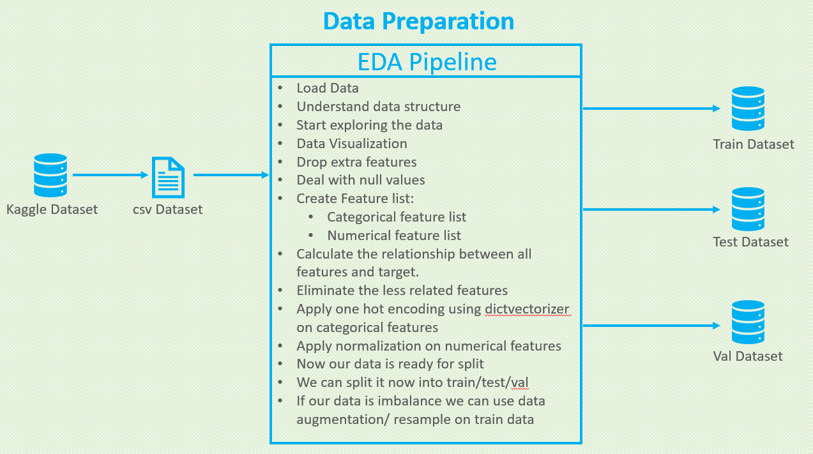
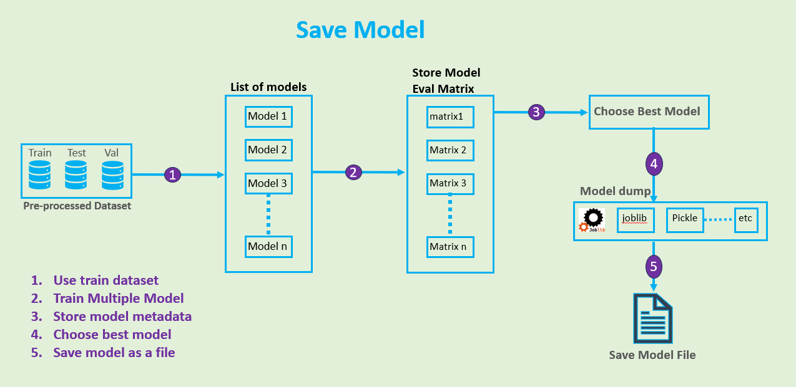
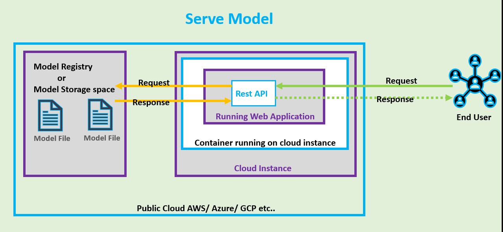
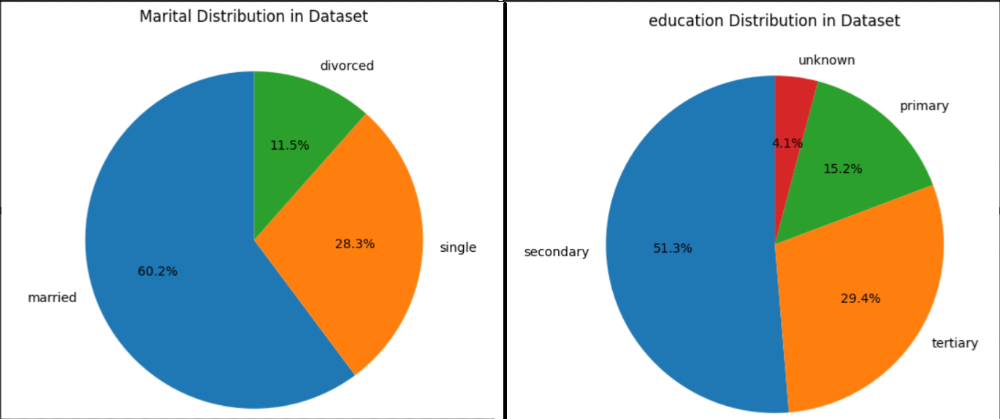

# Predict Term Deposit [Kaggle Link](https://www.kaggle.com/datasets/aslanahmedov/predict-term-deposit)


## Table of Contents:
1. [Problem description](#1-problem-description)
2. [Explore dataset Analysis EDA](#2-eda-notebook)
3. [Model training](#3-model-training-notebook)
4. [Exporting notebook to script](#4-exporting-notebook-to-script)
5. [Reproducibility](#5-reproducibility)
6. [Model deployment](#6-model-deployment)
7. [Dpendency and enviroment management](#7-dependency-and-enviroment-management)
8. [Containerization](#8-containerization)
9. [Cloud deployment](#9-cloud-deployment-ref)

## 1. Problem description
Bank has multiple banking products that it sells to customer such as saving account, credit cards, investments etc. It wants to which customer will purchase its credit cards. For the same it has various kind of information regarding the demographic details of the customer, their banking behavior etc. Once it can predict the chances that customer will purchase a product, it wants to use the same to make pre-payment to the authors.

In this part I will demonstrate how to build a model, to predict which clients will subscribing to a `Term Deposit`, with inception of machine learning. 

In the first part we will deal with the description and visualization of the analysed data, and in the second we will go to data classification models.

This dataset contains demographic and banking information about customers and also the outcome of the campaign, i.e. whether they subscribed to the product after the campaign or not. 

In this project, we want to train a model on this dataset in order to predict whether after a targeted campaign, a particular customer will subscribed to the product 'term deposit' or not. Since we want our model to predict yes or no, this is a binary classification problem.

## Data Load and EDA steps



## Save Model


## Serve Model



## 2. EDA Pipeline [notebook](./notebook.ipynb)
  * [Kaggle Dataset](https://www.kaggle.com/datasets/aslanahmedov/predict-term-deposit)
  * [wget link](https://raw.githubusercontent.com/rmnchopra91/ml-zoomcamp/main/homework/2023/07-Project/dataset/data.csv)

  ```bash
  !wget https://raw.githubusercontent.com/rmnchopra91/ml-zoomcamp/main/homework/2023/07-Project/dataset/data.csv
  ```

  * This dataset contains `45211` records with `18` features. Feature details are as Id,	age, job,	marital,	education,	default,	balance,	housing,	loan,	contact,	day,	month,	duration,	campaign,	pdays,	previous,	poutcome,	y,
  * Here `y` is the target label and rest are the dependent features.

  * Download Data
  * Load Dataset using pandas
  * Understand data structure
  * Drop null values
  * Data Visualization
  * Drop extra features
  * Create Feature list:
    * Categorical feature list
    * Numerical feature list
  * Calculate the relationship between all features and target.
  * Eliminate the less related features
  * Apply one hot encoding using dictvectorizer on categorical features
  * Apply normalization on numerical features
  * Now our data is ready for split
  * We can split it now into train/test/val
  * If our data is imbalance we can use data augmentation/ resample on train data

## Data Visualization



## 3. Model train and Save Model [notebook](./notebook.ipynb)
  * Split Dataframe into `train`, `val` and `test`
  * Preprocess dataset
  * Get evaluation matrix for multiple models
  * Choose Best model based on `evaluation matrics`
  * Save best model

## 4. Export notebook to .py file
  Logic for taining a model is exported to a script file [train.py](./train.py) file

## 5. Model deployment
  Model is deployed by using `Flask` web framework. Write Flask code into [predict.py](./predict.py) file. It will launch web server at below url: 
  [http://0.0.0.0:9696](http://0.0.0.0:9696)
  
  

  Test this model by runing [test.py](test.py) file. Here we have two examples. 

## 6. Dependency and enviroment management

Install `pipenv` into your machine
```bash
pip install pipenv
```

Set the python version which you want to use
```bash
pipenv install --python 3.10
```

Install all the dependencies mentioned in [Pipfile](./Pipfile)
```bash
pipenv install
```

Come to `pipenv shell`
```bash
pipenv shell
```

Now you can execute commands for training a model, generating predictions by using web framework like `Flask`, `fastAPI`

## 7. Containerization

* [Dockerfile](./Dockerfile)
* Start Docker Desktop


* Build docker image. [ref](https://github.com/DataTalksClub/machine-learning-zoomcamp/blob/master/05-deployment/06-docker.md)
```bash
docker build -t bank-term-deposite:latest .
```


* Run the docker image. (Before runing docker image we have to stop already runiing web server at 9696 port)
```bash
docker run -it -p 9696:9696 bank-term-deposite:latest
```


* Docker Test by running [predict-test.py](./predict-test.py) file


* Push docker image to docker hub container registry
  * From Google Chrome
    * Login to docker hub [link](https://hub.docker.com/)
    * Create repository `bank-term-deposit`
  * From terminal
    * Docker Login
    * Push docker image to docker hub
    ```
    docker login

    docker push dineshchopra/bank-term-deposit:latest
    ```
  
  

  * Pull docker image and run it
  ```
  docker pull dineshchopra/bank-term-deposit:latest
  ```
  * Run docker image, which is pulled from docker hub
  ```
  docker run -it -p 9696:9696 dineshchopra/bank-term-deposit:latest
  ```

<!-- 
Important Docer commands

Docker related commands
How to create Docker IMage using Dockerfile
    Run: docker build -t term-predict-app:latest .
How to check list of docker images
    Run: Docker images
How to check running Docker containers
    docker ps -a
How to run docker container using docker image
    Run: docker run -it -p 9696:9696 term-predict-app:latest
How to remove running Docker container
    Run: docker rm container-id
How to delete unwanted Docker images
    Run: docker rmi -f inage-id

Steps to push docker image to docker registry:
    1: docker login
    2: docker tag term-predict-app:latest rmnchopra91/term-predict-app:latest
    3: docker push rmnchopra91/term-predict-app:latest

Steps to run the complete project.
prerequisites:
    start docker deamon in your system
Step 1: docker pull rmnchopra91/term-predict-app:latest
Step 2: docker run -it -p 9696:9696 rmnchopra91/term-predict-app:latest -->